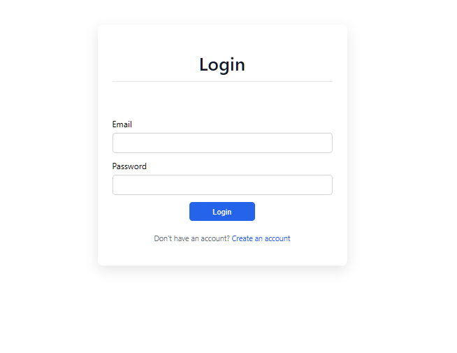
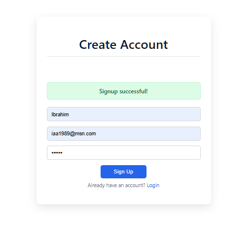
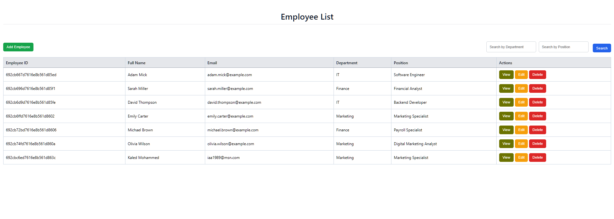
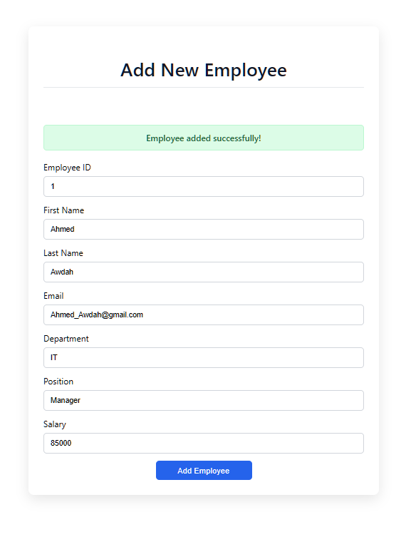
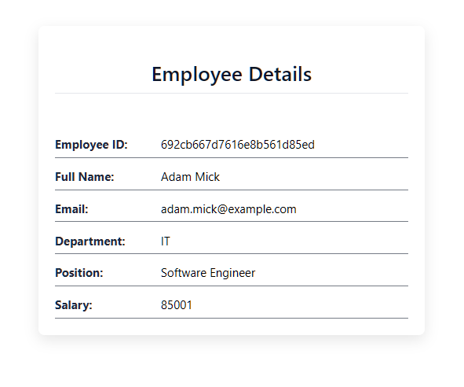
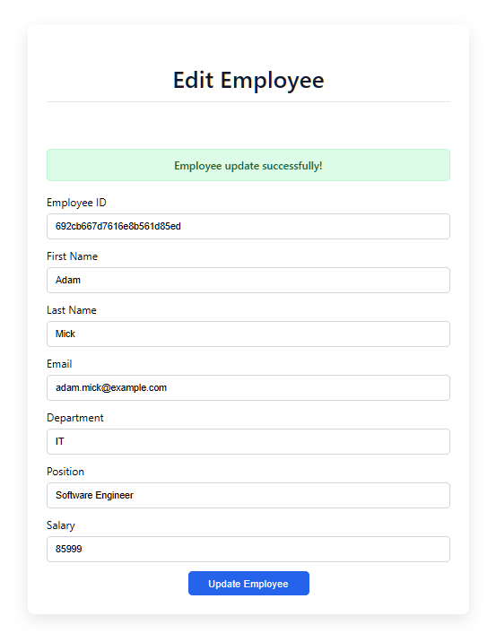

# Employee Management System (Full Stack)


A full-stack employee management web application built with **React**, **Node.js**, **Express**, and **MongoDB**.  
The application supports authentication, employee CRUD operations, search functionality, and containerized deployment using Docker.

---

## Tech Stack
- **Frontend:** React, React Router, Axios, Context API
- **Backend:** Node.js, Express, MongoDB, Mongoose
- **Authentication:** JWT (JSON Web Tokens)
- **DevOps:** Docker, Docker Compose

---

## Features
- User authentication (Signup / Login)
- Protected routes based on authentication
- View employee list
- Add, edit, and delete employees
- Search employees by department or position
- JWT stored securely in localStorage
- Authentication state managed using React Context API
- Dockerized full-stack environment

---

## Screenshots

### Login Page


### Signup Success


### Employee List


### Add Employee


### Employee Details


### Edit Employee



---

## Getting Started

### Option 1 - Run without Docker

### 1. Backend

```bash
 cd backend
 npm install 
 npm start
 ```

Backend runs on: http://localhost:8081 

### 2. Frontend

```bash
cd frontend
npm install
npm start
```

frontend runs on: http://localhost:3000


### Option 2 - Run with Docker (Docker Compose)

From the project root (Where docker-compose.yml is located)

To stop containers :
```bash
docker-compose down
```

To build :
```bash
docker-compose up --build
```

This will start 3 containers:
* comp3123-mongo -- MongoDB (port 27017:27017)
* comp3123-backend -- Backend (port 8081:8081)
* comp3123-frontend -- Frontend (port 3000:3000)

Then open:
* Frontend: http://localhost:3000
* Backend API: http://localhost:8081/api/v1


## API Endpoints Used 
```
* POST    /api/v1/user/signup
* POST    /api/v1/user/login
* GET     /api/v1/emp/employees
* POST    /api/v1/emp/employees
* PUT     /api/v1/emp/employees/:id
* DELETE  /api/v1/emp/employees/:id
* GET     /api/v1/emp/employees/search
```
## Build (Production)

From the frontend directory
```bash
npm run build
```

## What I Learned

* Building and structuring a full-stack MERN application.
* Implementing JWT-based authentication.
* Managing global auth state with React Context API.
* Integrating frontend and backend via REST APIs.
* Containerizing full-stack applications using Docker Compose.


## Author
**Ebrahim Al-Serri**  
Full Stack Developer | MERN Stack  